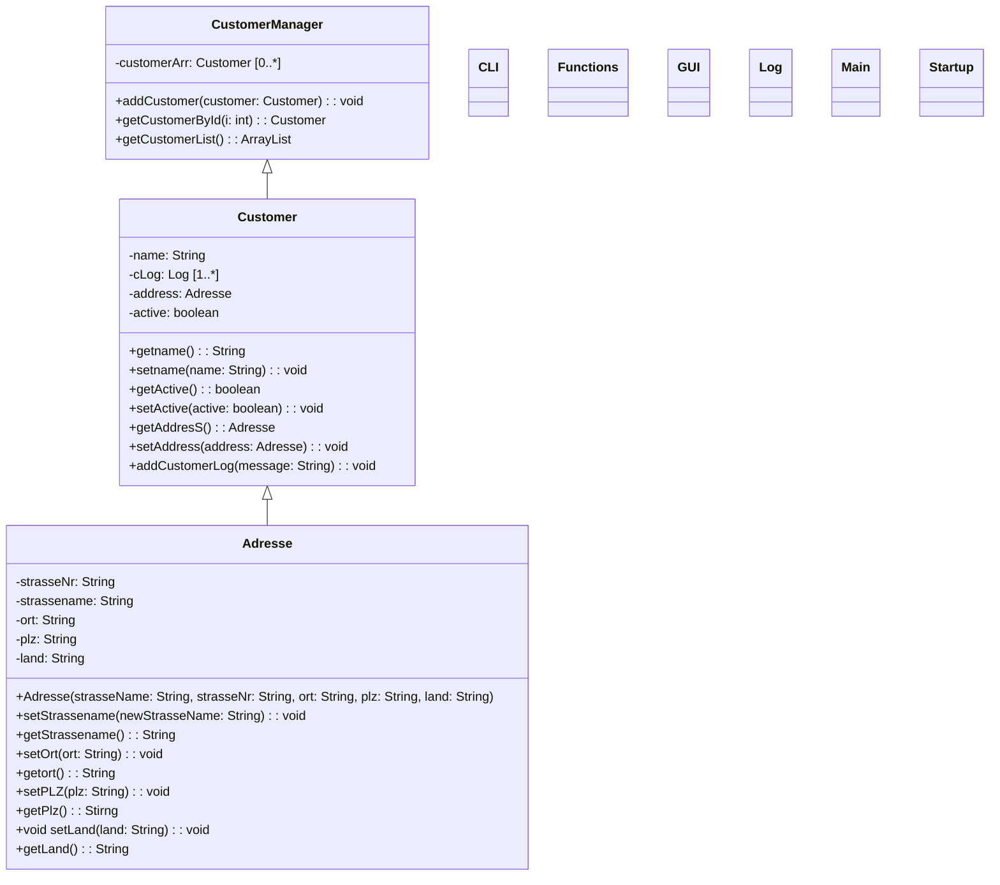

# Class-Diagram

[Help Mermaid](https://mermaid-js.github.io/mermaid/syntax/classDiagram.html)

Note to myself UML:

public (+)

protected (#)

private (-)

```mermaid
classDiagram
    Customer <|-- Adresse
    CustomerManager <|-- Customer

    class Adresse{
        -strasseNr: String
        -strassename: String
        -ort: String
        -plz: String
        -land: String
        +Adresse(strasseName: String, strasseNr: String, ort: String, plz: String, land: String)
        +setStrassename(newStrasseName: String): void
        +getStrassename(): String
        +setOrt(ort: String): void
        +getort(): String
        +setPLZ(plz: String): void
        +getPlz(): Stirng
        +void setLand(land: String): void
        +getLand(): String
    }

    class CLI {

    }

    class Customer{
        -name: String
        -cLog: Log [1..*]
        -address: Adresse
        -active: boolean
        +getname(): String
        +setname(name: String): void
        +getActive(): boolean
        +setActive(active: boolean): void
        +getAddresS(): Adresse
        +setAddress(address: Adresse): void
        +addCustomerLog(message: String): void
    }

    class CustomerManager{
        -customerArr: Customer [0..*]
        +addCustomer(customer: Customer): void
        +getCustomerById(i: int): Customer
        +getCustomerList(): ArrayList<Customer>
    }

    class Functions{

    }

    class GUI{

    }

    class Log{

    }

    class Main{

    }

    class Startup{

    }
```